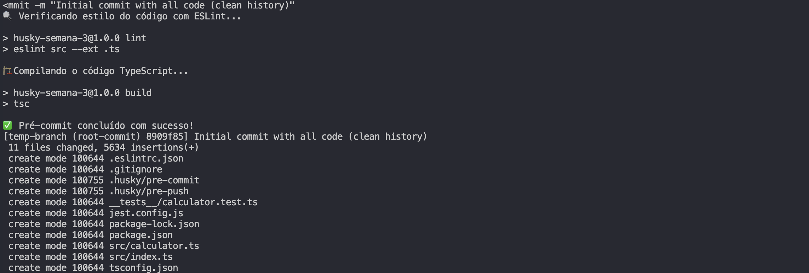

# Relatório de Configuração do Husky

Este relatório documenta o processo de configuração do Husky para automatizar verificações pré-commit e pré-push em um projeto Node.js com TypeScript.

## Etapa 1: Inicialização do Projeto

1. Inicialização do projeto Node.js:
   ```bash
   npm init -y
   ```

2. Instalação das dependências de desenvolvimento:
   ```bash
   npm install typescript @types/node ts-node jest @types/jest ts-jest --save-dev
   npm install eslint @typescript-eslint/parser @typescript-eslint/eslint-plugin --save-dev
   npm install husky --save-dev
   ```

3. Criação da estrutura básica do projeto:
   ```bash
   mkdir -p src __tests__
   ```

## Etapa 2: Configuração do Ambiente

1. Configuração do TypeScript (tsconfig.json):
   ```json
   {
     "compilerOptions": {
       "target": "es2016",
       "module": "commonjs",
       "outDir": "./dist",
       "rootDir": "./src",
       "strict": true,
       "esModuleInterop": true,
       "skipLibCheck": true,
       "forceConsistentCasingInFileNames": true
     },
     "include": ["src/**/*"],
     "exclude": ["node_modules", "__tests__"]
   }
   ```

2. Configuração do ESLint (.eslintrc.json):
   ```json
   {
     "parser": "@typescript-eslint/parser",
     "plugins": ["@typescript-eslint"],
     "extends": [
       "eslint:recommended",
       "plugin:@typescript-eslint/recommended"
     ],
     "rules": {
       "no-console": "warn",
       "@typescript-eslint/explicit-function-return-type": "warn"
     },
     "env": {
       "node": true,
       "jest": true
     }
   }
   ```

3. Configuração do Jest (jest.config.js):
   ```javascript
   module.exports = {
     preset: 'ts-jest',
     testEnvironment: 'node',
     testMatch: ['**/__tests__/**/*.test.ts'],
     collectCoverage: true,
     coverageDirectory: "coverage",
     coverageProvider: "v8"
   };
   ```

4. Configuração dos scripts no package.json:
   ```json
   "scripts": {
     "test": "jest",
     "build": "tsc",
     "lint": "eslint . --ext .ts",
     "start": "node dist/index.js",
     "dev": "ts-node src/index.ts",
     "prepare": "husky install"
   }
   ```

## Etapa 3: Desenvolvimento do Aplicativo

1. Criação da classe Calculator (src/calculator.ts):
   ```typescript
   export class Calculator {
     public add(a: number, b: number): number {
       return a + b;
     }

     public subtract(a: number, b: number): number {
       return a - b;
     }

     public multiply(a: number, b: number): number {
       return a * b;
     }

     public divide(a: number, b: number): number {
       if (b === 0) {
         throw new Error('Divisão por zero não é permitida');
       }
       return a / b;
     }
   }
   ```

2. Criação do arquivo principal (src/index.ts):
   ```typescript
   import { Calculator } from './calculator';

   function main(): void {
     const calculator = new Calculator();
     
     // Exemplos de uso da calculadora
     const soma = calculator.add(5, 3);
     const subtracao = calculator.subtract(10, 4);
     const multiplicacao = calculator.multiply(2, 6);
     const divisao = calculator.divide(20, 5);
     
     // eslint-disable-next-line no-console
     console.log(`Soma: ${soma}`);
     // eslint-disable-next-line no-console
     console.log(`Subtração: ${subtracao}`);
     // eslint-disable-next-line no-console
     console.log(`Multiplicação: ${multiplicacao}`);
     // eslint-disable-next-line no-console
     console.log(`Divisão: ${divisao}`);
   }

   if (require.main === module) {
     main();
   }
   ```

3. Criação dos testes (__tests__/calculator.test.ts):
   ```typescript
   import { Calculator } from '../src/calculator';

   describe('Calculator', () => {
     let calculator: Calculator;

     beforeEach(() => {
       calculator = new Calculator();
     });

     test('deve somar dois números corretamente', () => {
       expect(calculator.add(2, 3)).toBe(5);
       expect(calculator.add(-1, 1)).toBe(0);
       expect(calculator.add(0, 0)).toBe(0);
     });

     test('deve subtrair dois números corretamente', () => {
       expect(calculator.subtract(5, 2)).toBe(3);
       expect(calculator.subtract(1, 1)).toBe(0);
       expect(calculator.subtract(0, 5)).toBe(-5);
     });

     test('deve multiplicar dois números corretamente', () => {
       expect(calculator.multiply(2, 3)).toBe(6);
       expect(calculator.multiply(-2, 3)).toBe(-6);
       expect(calculator.multiply(0, 5)).toBe(0);
     });

     test('deve dividir dois números corretamente', () => {
       expect(calculator.divide(6, 2)).toBe(3);
       expect(calculator.divide(5, 2)).toBe(2.5);
       expect(calculator.divide(0, 5)).toBe(0);
     });

     test('deve lançar erro ao dividir por zero', () => {
       expect(() => calculator.divide(5, 0)).toThrow('Divisão por zero não é permitida');
     });
   });
   ```

## Etapa 4: Configuração do Husky

1. Inicialização do Husky:
   ```bash
   npm run prepare
   npx husky init
   ```

2. Criação do hook de pré-commit (.husky/pre-commit):
   ```bash
   #!/usr/bin/env sh
   . "$(dirname -- "$0")/_/husky.sh"

   echo "🔍 Verificando estilo do código com ESLint..."
   npm run lint || exit 1

   echo "🏗️ Compilando o código TypeScript..."
   npm run build || exit 1

   echo "✅ Pré-commit concluído com sucesso!"
   ```

3. Criação do hook de pré-push (.husky/pre-push):
   ```bash
   #!/usr/bin/env sh
   . "$(dirname -- "$0")/_/husky.sh"

   echo "🧪 Executando testes..."
   npm test || exit 1

   echo "✅ Pré-push concluído com sucesso!"
   ```

4. Concedendo permissões de execução aos scripts:
   ```bash
   chmod +x .husky/pre-commit .husky/pre-push
   ```

## Etapa 5: Execução e Validação

### Demonstração do hook de pré-commit



### Demonstração do hook de pré-push


## Conclusão

A configuração do Husky foi realizada com sucesso, permitindo a execução automática de verificações importantes antes de cada commit e push:

1. **Pré-commit**: 
   - Verificação de estilo de código com ESLint
   - Compilação do código TypeScript

2. **Pré-push**:
   - Execução dos testes automatizados

Esta configuração garante que apenas código validado e testado seja integrado ao repositório, melhorando a qualidade do código e prevenindo erros. 